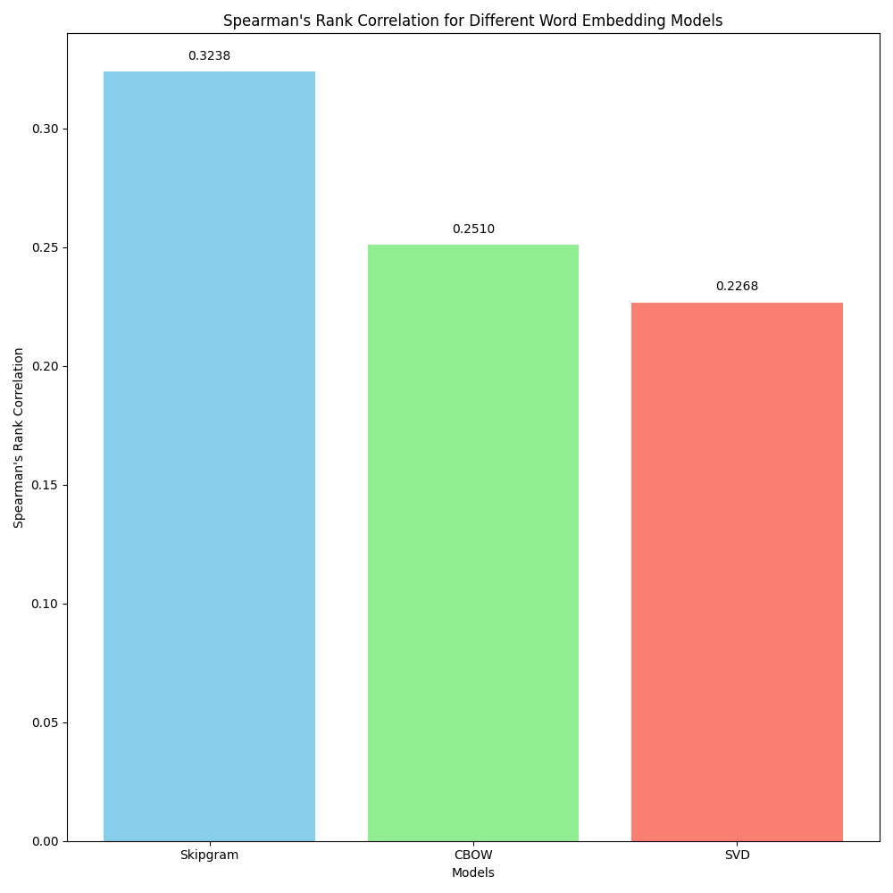

## Name: Kritin Maddireddy

## Roll No.: 2022101071

---

# Analysis

All three models were trained on the _Brown Corpus (all sentences)_, and their word embeddings were analysed on the
_WordSim353 (Crowd)_ task, while their performance was evaluated using the _Spearman Rank Correlation_ metric.

## Hyperparameters used:

The following parameters were used for training the embeddings:

1. **SVD**
    - Word Embedding Dimension: 300
    - Window Size: 3
    - Minimum Frequency: 3

2. **CBOW with Negative Sampling**
    - Word Embedding Dimension: 300
    - Window Size: 3
    - Minimum Frequency: 3
    - Batch Size: 256
    - Number of Epochs: 10
    - Learning Rate: 1e-3
    - Number of Negative Samples: 5

3. **Skipgram with Negative Sampling**
    - Word Embedding Dimension: 300
    - Window Size: 3
    - Minimum Frequency: 3
    - Batch Size: 256
    - Number of Epochs: 5
    - Learning Rate: 1e-3
    - Number of Negative Samples: 5

---

## Spearman's Rank Correlation for the models

| Technique                       | Spearman Rank Correlation |
|---------------------------------|---------------------------|
| SVD                             | 0.2268                    |
| CBOW with Negative Sampling     | 0.1904                    |
| Skipgram with Negative Sampling | 0.3238                    |

Clearly, when trained on the same dataset with the same window size, **SVD** performs better than **CBOW**, and
**Skipgram** performs better than both of them, on the _WordSim_ task. Note that here, for the **Spearman Rank
Correlation** value, higher is better, as it implies that for those similar pairs of words, the computed Cosine
Similarity agrees better with human assigned scores.

However, SVD takes much longer than CBOW to train and create the embeddings, and Skipgram takes about the same time as
SVD (it is perhaps a little faster).

---

## Techniques used

### Singular Value Decomposition

#### Description

SVD is used to factorize a matrix into three matrices. In the context of word embeddings, we apply SVD on a word
co-occurrence matrix, and using SVD, the decomposed matrices are those that capture semantic relationships between
words (which is precisely what we want).

#### Benefits

1. It is deterministic; it does not have an "initialization" and thus it always produces the same word embeddings every
   time it is run on the same data. You do not need to set a seed value in order for it to be deterministic.
2. It captures global structure of the data better. This means that it can identify broader patterns and relationships
   within the entire dataset. Could help for applications like document clustering since it can figure out overall
   semantic themes better.

#### Limitations

1. It is computationally expensive! It only gets worse as the size of the dataset increases. In this case, SVD took
   about 20 minutes to produce the word embeddings, while running on an RTX 3060 GPU.
2. Its ability to capture global context is also its limitation; it trades off the ability to capture local context
   well, in order to capture global context better. So, it doesn't capture the immediate context surrounding a word.
   Meanwhile, the other methods such as CBOW and Skipgram are specifically designed to capture these local contextual
   relationships more effectively.

### Continuous Bag of Words with Negative Sampling

#### Description

CBOW is a neural network based method that **predicts a target word based on its context words**. Here, we use
negative sampling in order to efficiently train the model by sampling some negative examples. In negative sampling,
instead of updating the model with all possible incorrect words (which would be computationally expensive as it would
take a very long time to train), a small number of "negative" words are sampled from the vocabulary and used for
updating. This significantly speeds up training and makes it feasible to train on large datasets.

#### Benefits

1. It is computationally efficient to train, and it works well with large datasets.
2. It captures contextual information pretty efficiently (depends on a window size which you need to specify) by
   predicting the target word based on its context words.

#### Limitations

1. For the same dataset, it tends to perform worse than other methods, when all the hyperparameters are the same. You
   would need tweak the hyperparameters a lot in order to make it perform better than it normally does.
2. It fundamentally performs worse on smaller datasets (like the Brown Corpus) that we trained it on in this case. This
   is because it doesn't have sufficient context to learn meaningful embeddings. On larger datasets however, it should
   perform better, as it gets enough context to "understand" when certain words are used (and the multiple different
   contexts in which the same word can be used).

### Skipgram with Negative Sampling

#### Description

Skipgram is another neural network based method that **predicts context words based on a target word**. Again, we use
negative sampling here just like in CBOW, to reduce the computational complexity by focusing on a subset of negative
examples during training.

#### Benefits

1. Since it tries to figure out the context by itself rather than learning the context for a given word, it tends to
   perform better than CBOW.
2. Due to the above reason, it does not require a large dataset in order to work effectively.
3. It can even learn representations effectively for words that are rarely used.

#### Limitations

1. It is computationally expensive to train (took about 17 minutes on an RTX 3060 for this task), as it tries to predict
   context for a given word (and there's a lot of possible context that can be predicted for a single word). As the size
   of the dataset increase, the time taken to train only becomes longer.

---

## Additional Data

**Please find the results for the similarity task here:**
1. **SVD:** 
   1. [output.txt](similarity_results/svd/output.txt)
   2. [similarity_results.csv](similarity_results/svd/similarity_results.csv)
2. **CBOW:**
   1. [output.txt](similarity_results/cbow/output.txt)
   2. [similarity_results.csv](similarity_results/cbow/similarity_results.csv)
3. **Skipgram:**
   1. [output.txt](similarity_results/skipgram/output.txt)
   2. [similarity_results.csv](similarity_results/skipgram/similarity_results.csv)